[](https://classroom.github.com/a/vbnbTt5m)
[](https://classroom.github.com/online_ide?assignment_repo_id=15271664&assignment_repo_type=AssignmentRepo)
# Dev_Setup
Setup Development Environment

#Assignment: Setting Up Your Developer Environment

#Objective:
This assignment aims to familiarize you with the tools and configurations necessary to set up an efficient developer environment for software engineering projects. Completing this assignment will give you the skills required to set up a robust and productive workspace conducive to coding, debugging, version control, and collaboration.

#Tasks:

1. Select Your Operating System (OS):
   Choose an operating system that best suits your preferences and project requirements. Download and Install Windows 11. https://www.microsoft.com/software-download/windows11
   
   REQUIREMENTS:
Windows installation media. This could be an installation ISO or DVD.This could be an installation ISO or DVD.
A free USB flash drive with a minimum of 5GB available space on the drive, it is advisable that nothing important be stored on the drive as the flash will be formatted.
Technician PC - Windows Computer you will be using to format the USb Flash Drive
Destination PC – It is a PC on which you are going to make the Windows operating system installed.

1. First, in order to start configuring the operating system parameters, format the drive and set the primary partition to active.
Plug in the USB flash drive into a technician PC.
Open Disk Management: Click the right button click it again and select Disk Management.
Format the partition: To format the USB drive partition right click the partition and select the Format option from a given list of options. Choose FAT32 file system to allow boot on BIOS-M or UEFI- M firmware.
Set the partition as active: Go to partition manager tab and use right-click on the partition on the USB drive and select the option of Mark Partition as Active.
2. For Windows XP, use files located under Windows Setup folder and copy it to Windows USB flash drive you have. With the help of the File Explorer, transfer the ISO version of the Windows product DVD or DVD content to the USB flash drive without any modifications.
Optional: initialize a unattend file for the purpose of making the installation process smooth and automatic. More Detail on Automate Windows Setup is available.
3. Copying or downloading Windows into the new PC.
Plug your USB flash drive into another computer that the virus has not infected.
Start the PC and while the manufacturer’s splash screen is displayed press on a specific key for boot device selection like Esc/F10/F12 etc. Choose the one that leads to the loading of PC from USB flash drive.
Windows Setup starts. The instructions for installation of Windows have to be followed.
Eject the USB flash drive.

2. Install a Text Editor or Integrated Development Environment (IDE):
   Select and install a text editor or IDE suitable for your programming languages and workflow. Download and Install Visual Studio Code. https://code.visualstudio.com/Download

   1. Start by opening your preferred web browser for example Chrome, Firefox, Microsoft Edge
   2. Go to the visual studio code website 
   3. Choose the installer that matches your operating system (Windows, macOS, or Linux). In my case i will go with windows. 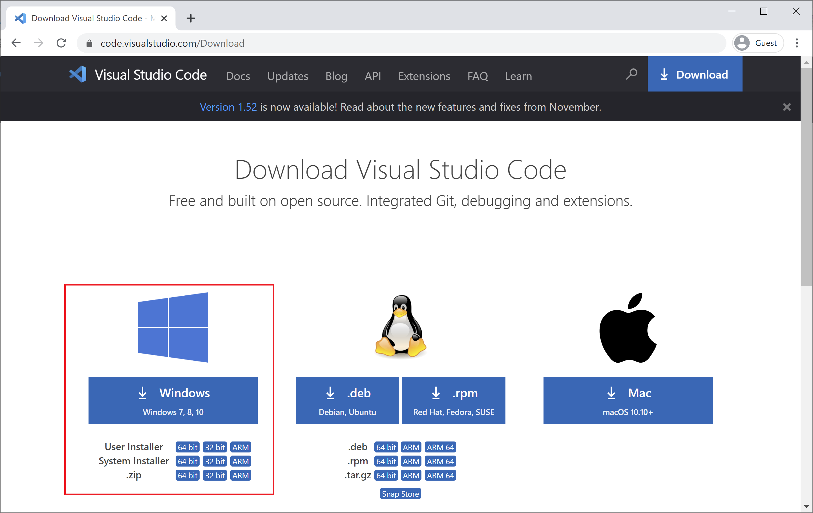
   5. After downloading, look for the installer file in the Download folder and double click it to execute it. 
   6. On the first screen that appears on the interface of the program, click on the Next button after clicking on accept agreement. 
   7. Choose the destination folder in which you would like VS Code to be installed. It is often best to stick to the default option. Click Next.
   8. Select any extra options you would like – may be creating a shortcut to the desktop or a link with VS Code, .js, .ts, .html and etc. Click Next. 
   9. Click the Install button and wait for the confirmation that the process is done. 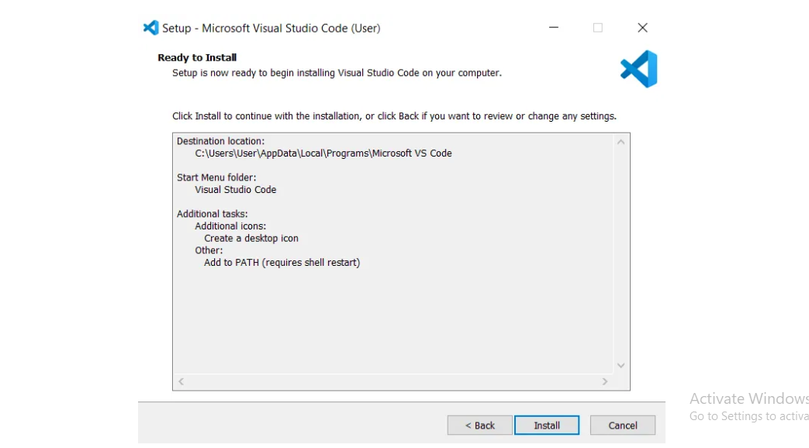
   10. Click Finish to exit Setup. Check in the check box to launch VS Code right now. 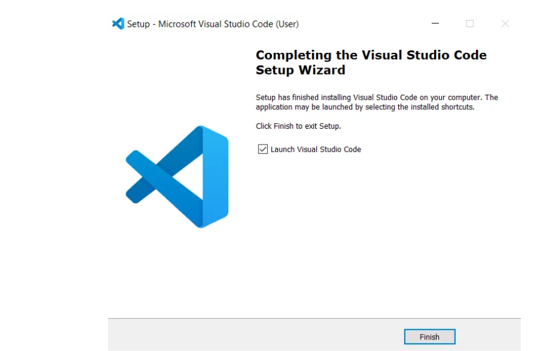


3. Set Up Version Control System:
   Install Git and configure it on your local machine. Create a GitHub account for hosting your repositories. Initialize a Git repository for your project and make your first commit. https://github.com

   Depending on your operating system, installation of Git can be done through the following:
   1. Navigate to the official Git downloads page and click the download link for the latest Git version for Windows:  If you're using a Windows system, you can download the latest Git version for 64-bit systems from the link provided. For those on a 32-bit system, there's also a 32-bit Git installer available.
   2. Find the file you downloaded and double-click it to start the installation process. During installation, the default settings are typically fine to use, so you can proceed with them. 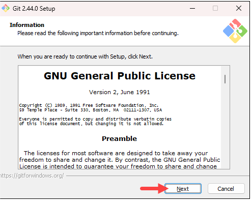
   3. During the installation, you will be asked to choose a location for installation. You can proceed with the default location by clicking 'Next', or select a different one if you prefer. 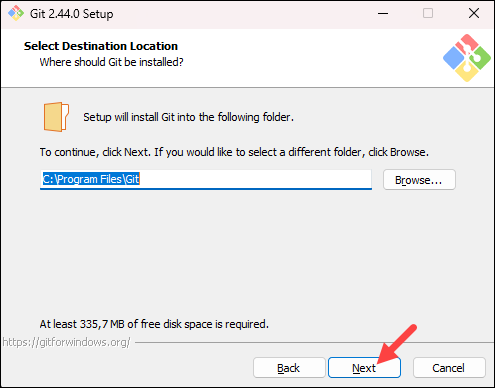
   4. At the component selection screen, you may keep the default selections or adjust them as needed before clicking 'Next'. 
   5. The installer will suggest creating a folder in the start menu. Click 'Next' to agree and move on to the subsequent step. 
   6. Choose your preferred text editor for Git from the drop-down menu (in my case i went with Notepad++), and proceed by clicking Next. 
   7. At the following step, you have the option to rename your initial branch, which is set to 'master' by default. If you're not collaborating with a team that needs a specific name, keep the default and click Next. 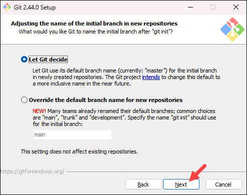
   8. Next, you'll have the opportunity to modify the PATH environment, which determines the default directories accessed during command line operations. Then click Next. 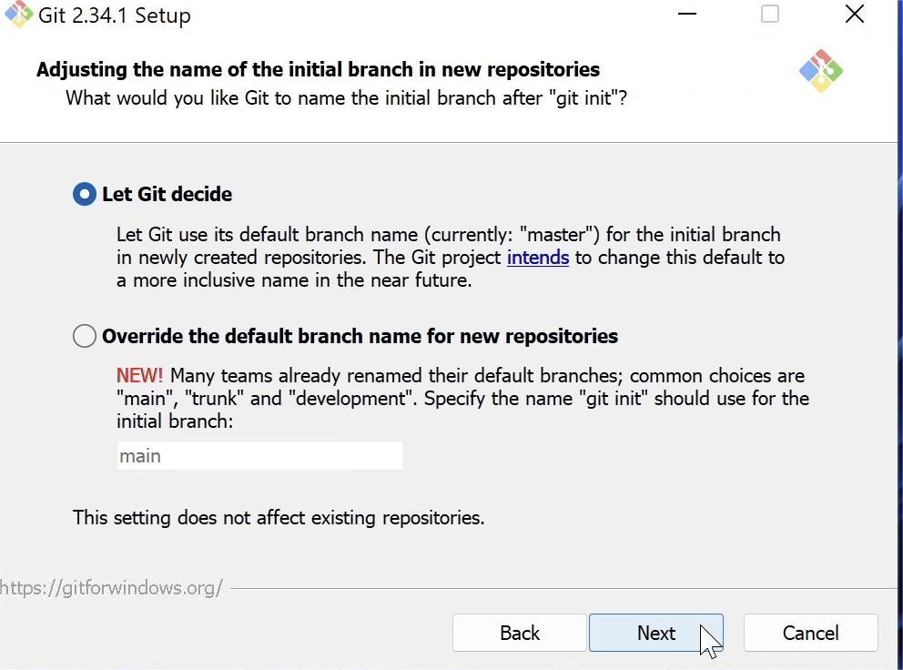
   9. During the installation, you'll be asked to choose an SSH client for Git. Since Git includes its own SSH client, you can proceed with the pre-selected default option by clicking 'Next' unless you require a particular one. 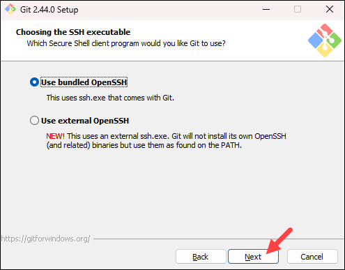
   10. Next, you'll encounter a choice regarding server certificates. Stick with the default for general use, or opt for Windows Store certificates if you're in an Active Directory setting. Choose accordingly and proceed by clicking 'Next'. 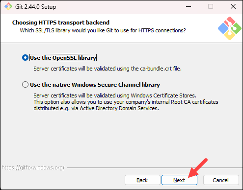
   11. The upcoming choice sets up line-ending conversions, affecting data format. The default is advised for Windows users. Click 'Next' to continue. 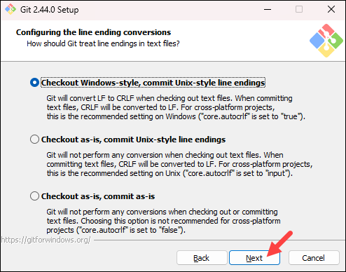
   12. Select the terminal emulator of your choice. For its enhanced functionality, MinTTY is the advised default option. To proceed, click 'Next'. 
   13. Next, you have the option to configure the actions of the git pull command. Unless you require a specific modification, it's best to go with the default selection. To move forward with the setup, click 'Next'.
   14. Next, you'll need to decide on a credential helper. The default selection is known for its stability. After picking the credential manager of your choice, hit 'Next' to proceed.
   15. In the subsequent step, you have the option to enable additional features. Maintain the file system caching option as selected and proceed by clicking 'Next'. 
   16. Depending on which Git version you are installing, it may offer to install experimental features. To ensure the most reliable performance, avoid installing features labeled as experimental and proceed by selecting 'Install'.
   17. After the installation concludes, select the options to either review the Release Notes or open Git Bash to begin using Git immediately, then click 'Finish'. 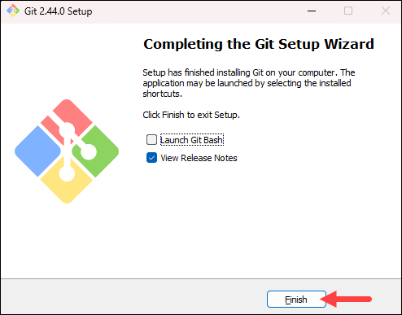


4. Install Necessary Programming Languages and Runtimes:
  Instal Python from http://wwww.python.org programming language required for your project and install their respective compilers, interpreters, or runtimes. Ensure you have the necessary tools to build and execute your code.

   DOWNLOADING PROCESS:
  1. Launch a web browser and proceed to the 'Downloads for Windows' page on the official Python website. 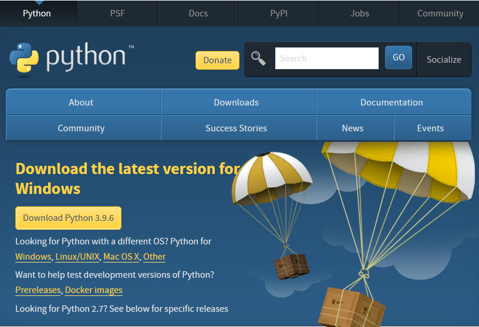 
  2. Activate the download by clicking on the appropriate link and select the suitable version for your system, be it the 32-bit or 64-bit Windows installer. 
  3. The executable file, will begin downloading to your default download directory. The file size is approximately 25 Mb, and depending on your internet speed, the download duration may vary.
  4. You will find the file in your Downloads folder. Transfer this file to a different location for long-term storage, which will facilitate the installation of Python and allow for straightforward reinstallation if needed in the future.

  INSTALLING:
  1. To begin the installation, simply double-click on the file named 'python-3.9.6-amd64.exe', and a setup window for Python 3.9.6 (64-bit) will pop up.  Make sure to check the boxes for 'Install launcher for all users (recommended)' and 'Add Python 3.9 to PATH' before you proceed, which are located at the bottom of the window.
  2. For the recommended setup, simply choose the 'Install Now' option.
  3. When you run the installer, you might see a User Account Control pop-up asking for permission to make changes to your device. Just click 'Yes' to proceed. After that, you'll see the Python 3.9.6 (64-bit) Setup window pop up, showing you the installation progress with a handy progress bar. 
  4. As the installation goes on, you'll see a list of components being installed and a progress bar that fills up as it moves along. Once everything is done, a new window will pop up to let you know that the Python 3.9.6 (64-bit) setup was successful. 
  5. After that, all you need to do is click 'Close', and you're all set! Python should be installed on your device now.

  VERIFYING:
  1. To verify if Python is installed, you can type `python --version` or `python -V` in your command prompt. This will show you the installed Python version if it's been set up correctly. 


5. Install Package Managers:
   If applicable, install package managers like pip (Python).
   1. To check if PIP is installed on your system, you can open your command prompt and type the following command:  This command will show you the version of PIP installed if it is present on your system. If PIP is not installed, you’ll see an error message indicating that the command is not recognized. If its not installed follow the instructions:
   1. First, you’ll need to get a file called get-pip.py. This is a special script that will install PIP for you.
   2. Use your web browser to go to the following web page: https://bootstrap.pypa.io/get-pip.py.
   3. Once there, right-click on the page and select “Save Page As…” or similar option depending on your browser.
   4. Choose a place on your computer where you can easily find it, like your “Downloads” folder or your desktop, and save the file there.
   5. Open a command prompt and navigate to the folder containing get-pip.py.
   6. Run the following command: 
   7. Once PIP installation is finished, confirm its success by executing pip --version in the command prompt once more.


6. Configure a Database (MySQL):
   Download and install MySQL database. https://dev.mysql.com/downloads/windows/installer/5.7.html
   1. Obtain the `mysql-installer-community.msi` bootable file to enable the installation of all components offline. 
   2. If asked to log in or register for an Oracle Web account, you can bypass this by selecting "No thanks, just start my download." 
   3. After the download finishes, execute the installation file.
   4. The MySQL Installer will start. Choose the setup type. "Developer Default" is a good choice if you want to install MySQL server and client applications. Click "Next."  
   5. The installer will display the products available for installation. Press "Execute" to start the process. 
   6. In the following step, the installer will prompt you to configure certain components. Click "Next" to continue with the configuration process. 
   7. Upon opening the window, all default settings necessary for MySQL Server will be preset, so you can proceed by clicking "Next". 
   8. Next, select the authentication type. Stick with the suggested option and move to the following step.
   9. Next up, you'll set your root password in the new window that pops up. Also, if you want to add more users, just hit the "Add User" button and fill out the details required.  Click "OK". It will create the user and set the password for the root user. Click "Next".
   10. The installer will offer to run the MySQL Server as a windows service, where it will be automatically started whenever a user logs into that particular Windows system. If you clear this option you will have to run it from a command prompt window since the application needs to use elevated privileges.
   11. To update the configuration parameters, simply press the "Execute" button. Once all items are confirmed with green ticks, click "Finish" to complete the process.

Concerning the name of the resultant Windows service, you can either use the suggested name or enter a completely different name. The next checkbox is definable to start up the service and the server simultaneously. When in the Run Windows Service block, it is necessary to select the particular account that shall run the service. No modification shall be done here and select what is provided by the installer alone.


7. Set Up Development Environments and Virtualization (Optional):
   Consider using virtualization tools like Docker or virtual machines to isolate project dependencies and ensure consistent environments across different machines.

8. Explore Extensions and Plugins:
   Explore available extensions, plugins, and add-ons for your chosen text editor or IDE to enhance functionality, such as syntax highlighting, linting, code formatting, and version control integration.

   Popular text editors and IDEs have many extensions, plugins, and add-ons to improve the capabilities around syntax highlighting, linting, code formatting, and version control integrations. So I take a look at one of the most common text editors, Visual Studio Code (VS Code), and some of the most popular tools that you will find people using below;
  1.  Visual Studio Code (VS Code)
  For Visual Studio Code, here are some highly recommended extensions that cater to software engineering and programming:

Prettier: This is like the ultimate stylist for your code. It tidies up your code in a consistent style across various languages, making it look good and readable.
ESLint: Think of this as your coding companion that keeps an eye out for mistakes and helps you stick to best practices in JavaScript.
GitLens: It's like having x-ray vision for your codebase. You can see who wrote what and when, right in the editor, which is super handy for understanding code history.
Live Share: This is teamwork made easy. You can code together with others in real-time, no matter where you are.
Python: It's everything a Python developer could wish for, all rolled into one—smart autocomplete, error checking, and even debugging tools.


9. Document Your Setup:
    Create a comprehensive document outlining the steps you've taken to set up your developer environment. Include any configurations, customizations, or troubleshooting steps encountered during the process. 

    Configuring a development workspace requires a series of actions to confirm the presence of all vital tools and settings for effective programming work.This guide outlines the steps, configurations, and troubleshooting actions taken during the setup process.

1. Selecting an Operating System: Your choice should align with the technologies you plan to use. For iOS app development, macOS is indispensable. For backend development, Linux distributions like Ubuntu offer robustness and flexibility.
2. Configuring the Terminal: Command-line interaction is facilitated by terminals. Windows users can leverage PowerShell, while macOS users have Terminal.app and iTerm2 as alternatives. Linux offers various shells, with bash being the default, alongside zsh or fish.
3. Choosing a Code Editor: Visual Studio Code (VS Code) is a favorite for its vast extension library and multi-language support. Personalize it with themes, and adjust settings such as autosave and keybindings to enhance your coding experience.
4. Setting Up Version Control with Git: Track your code changes efficiently by configuring Git with your details:
```bash
git config --global user.name "Your Name"
git config --global user.email "your.email@example.com"
```
Securely connect to GitHub by adding an SSH key to your account.
5. Installing Programming Languages: Use official sources or version managers like pyenv or nvm to install languages such as Python or Node.js.
6. Utilizing Package Managers: Manage your project's libraries with tools like pip for Python or npm/yarn for JavaScript/Node.js.
7. Managing Databases: Choose MySQL or PostgreSQL based on your needs. Install them directly or use Docker for simplified management.
8. Handling Environment Variables: Safeguard configuration settings and secrets by setting environment variables:
```bash
export DATABASE_URL="your_database_url"
export SECRET_KEY="your_secret_key"
```
9. Enhancing VS Code: Integrate extensions for code quality (ESLint), formatting (Prettier), IntelliSense, and more.
10. Setting Up Local Servers: Use XAMPP for Apache or Docker containers to replicate production environments locally.
11. Configuring Debugging Tools: Set up language-specific launch configurations in VS Code for debugging.
12. Installing Testing Framework: Use npm or pip to install testing frameworks like Jest for JavaScript or unittest for Python.
13. Documenting Your Code: Employ JSDoc for JavaScript or Sphinx for Python to create documentation from code comments.
14. Integrating Performance Monitoring: Implement tools like New Relic or Datadog for real-time performance insights.

Troubleshooting Tips

- Resolve permission issues during package installation with sudo (Linux/macOS) or by running the command prompt as an administrator (Windows).
- Fix path errors by ensuring compiler/interpreter paths are in your system’s PATH variable.
- Identify conflicting editor plugins by disabling and re-enabling them one at a time.

In conclusion, setting up a developer environment is a personalized process that involves selecting tools and technologies that align with your project requirements and personal preferences. The steps outlined provide a foundation for creating a robust, efficient, and scalable development workspace. By carefully configuring each component, from the OS to performance monitoring tools, you create an ecosystem that supports best practices in software development, streamlines your workflow, and ultimately enhances productivity. Regularly updating and maintaining this environment ensures that you stay current with the latest advancements in technology and security.

#Deliverables:
- Document detailing the setup process with step-by-step instructions and screenshots where necessary.
- A GitHub repository containing a sample project initialized with Git and any necessary configuration files (e.g., .gitignore).
- A reflection on the challenges faced during setup and strategies employed to overcome them.

#Submission:
Submit your document and GitHub repository link through the designated platform or email to the instructor by the specified deadline.

#Evaluation Criteria:**
- Completeness and accuracy of setup documentation.
- Effectiveness of version control implementation.
- Appropriateness of tools selected for the project requirements.
- Clarity of reflection on challenges and solutions encountered.
- Adherence to submission guidelines and deadlines.

Note: Feel free to reach out for clarification or assistance with any aspect of the assignment.
